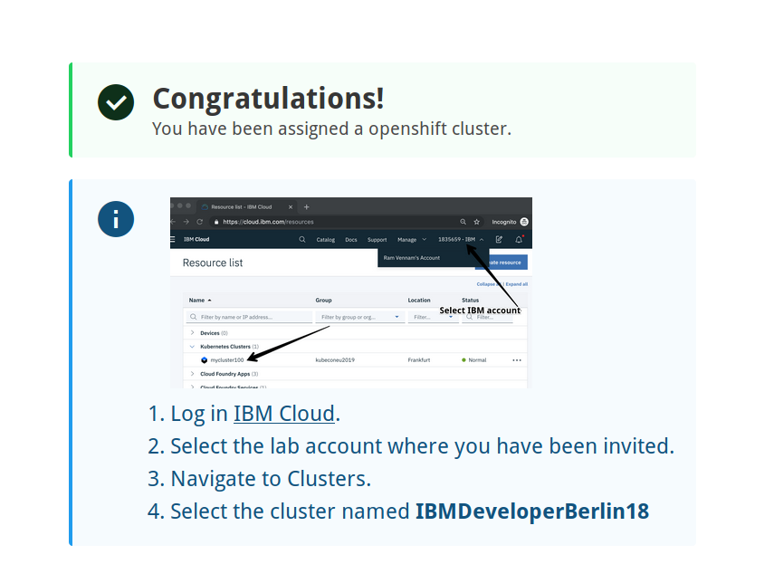
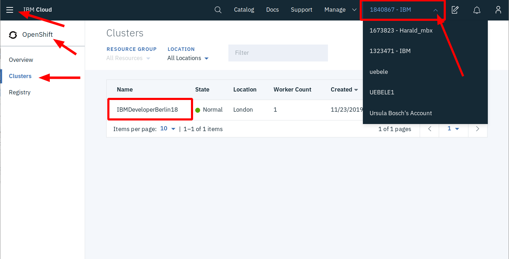

# OpenShift on IBM Cloud Instructions

---
## WiFI:  
## SSID = IBMClassroom
## Password = garageibm
---

1. If you haven't already done so register for a free IBM Cloud Account:
    * [https://ibm.biz/developer-dach](https://ibm.biz/developer-dach)
    * Check your emails for a verification mail and click the link within

2. We have created pre-configured OpenShift clusters. 

    The clusters are located in one of our Frankfurt datacenters (region "eu-central")

    To assign yourself to one of these:

    * Go to [https://ibm.biz/unconf-rhcluster](https://ibm.biz/unconf-rhcluster)
    * Lab key for this lab is "oslab"
    * Enter the IBM ID (the one you registered on IBM Cloud)  
    * Accept the T&Cs
    * Click submit

    

    If everything works you will see a confirmation like this one:

    

3. Access your OpenShift cluster

    * Logon to the IBM Cloud

    

    * Select the `1840867 - IBM` account in the menu, right side
    * Open the Burger menu (top left) --> OpenShift --> Clusters
    * Click on the cluster assigned to you, it should be the same from the confirmation above
    * Then click on "OpenShift web console"

4. Prepare your work environment

    * We need several tools: docker, git, oc, ibmcloud, to name a few
    * You can either:
         * install those on your laptop or 
         * use a [Docker Tools image](https://github.com/IBM/openshift-on-ibm-cloud-workshops/blob/master/2-deploying-to-openshift/documentation/1-prereqs.md#tools) we created for this lab or
         * use a "Cloud Shell" in a Browser **if you haven't installed Docker, can not install, or do not want to install apps on your notebook** 
    * To access the Cloud Shell (Beta) to IBM Cloud with your IBM ID and select your own account, not the `1840867 - IBM` where your cluster resides and open IBM Cloud Shell from the menu.
    
5. The workshop itself is here [https://ibm.biz/roks201](https://ibm.biz/roks201)

    * Section "1. Installing Prerequisites" is important
         * Ignore the instructions to setup an OpenShift cluster
         * The option to use Cloud Shell mentioned above is not documented but you can use the "Tools - Option 3: Install Tools on you Notebook". All the required command line tools are already installed in the Cloud Shell, just start with "Step 2: Get the code"
    * **Skip** sections "2. Running the Java microservice locally" and "3. Understanding the Java implementation". They are **optional** and will take too much time for this workshop!
    * We recommend doing the workshop itself in sequence 4, 8, 5, 6, and 7
    

